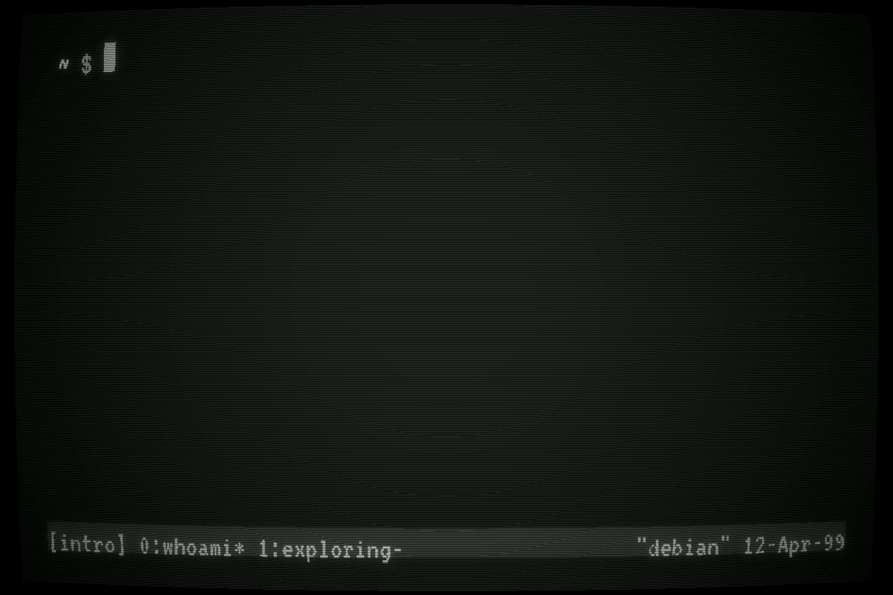

# Artem Dragunov



<details>
<summary>Behind the scenes</summary>
<br>

It's a real program, not a screen recording of me typing:

```sh
gcc main.c -o intro -lncursesw -lm && ./intro
```

Recorded with [asciinema](https://asciinema.org) and [agg](https://github.com/asciinema/agg), in my Tomorrow Night xterm colors:

```sh
TERM=xterm-256color asciinema rec --cols 68 --rows 17 -c "timeout --foreground 21.70 ./intro" raw.cast
# keep exactly one 21.08s loop, without the exit that would blank the last frame
jq -c 'select(type == "object" or (.[0] < 21.08 and .[1] == "o"))' raw.cast > demo.cast
agg --font-family "JetBrainsMonoNL Nerd Font Mono" --font-size 26 --fps-cap 30 --last-frame-duration 0 \
    --theme 1d1f21,c5c8c6,282a2e,cc6666,b5bd68,f0c674,81a2be,b294bb,8abeb7,c5c8c6,969896,cc6666,b5bd68,f0c674,81a2be,b294bb,8abeb7,ffffff \
    demo.cast raw.gif
# drop agg's padding on the sides and bottom so the tmux status line runs edge to edge
ffmpeg -i raw.gif -vf "crop=iw-32:ih-17:16:0,split[a][b];[a]palettegen=stats_mode=full[p];[b][p]paletteuse=dither=none" -loop 0 demo.gif
```

</details>
